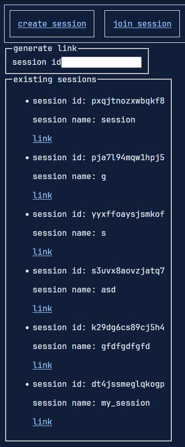

This is a [Next.js](https://nextjs.org/) project bootstrapped with [`create-next-app`](https://github.com/vercel/next.js/tree/canary/packages/create-next-app).

## Getting Started

First, run the development server:

```bash
npm run dev
# or
yarn dev
# or
pnpm dev
```
This project uses pocketbase for the back end.

Open [http://localhost:3000](http://localhost:3000) with your browser to see the result.

To start pocketbase :

```bash
# linux
./pocketbase serve
# windows
./poketbase.exe serve
```

Open the URL(s) displayed. There will be an adim interface route and an API route.

## Creating a Session

## Session list

## Joining a session

## Full session view

